# AgentForge

AgentForge is a local-first planner and generator for agentic product demos. Start with a plain-English app idea, draft and validate an App Blueprint, then generate a runnable FastAPI + React app with deterministic tests, sample data, scripted agent chat, and persisted workspace surfaces.

AgentForge also helps with existing repositories: it can analyze a repo, plan possible extensions, prepare safe patch bundles, and produce deployment readiness guidance without mutating the target repo by default.

## Try this first

```bash
pip install -e generator/
agentforge serve-builder
```

Open the printed local URL, choose **Start from an app idea**, draft a plan, then use the generated CLI commands. No API keys, cloud account, live LLM, or deployment target is required for the default demo path.

## Why it is safe to try

AgentForge is designed for local validation before any risky action:

- The Builder and scripted planner run locally.
- Validation does **not** require live LLM/API access.
- Existing-repo analysis and planning do **not** modify repos by default.
- Patch apply mode is explicit and limited to low-risk docs, blueprint, and checklist files.
- The deployment planner creates guidance only; it does **not** deploy infrastructure.
- Optional live provider modes are separate from the default scripted/local path.

## How it works

```text
New app idea
  → draft / validate App Blueprint
  → generate local FastAPI + React app
  → run a generated local workflow
  → use scripted agent chat and workspace

Existing repo
  → analyze repo
  → plan extension
  → prepare safe patch bundle
  → plan deployment readiness
```

For the generated-app path:

```text
App Blueprint YAML + controlled customization + Application Template = Generated App
```

## Screenshot walkthrough

The screenshots show the Builder and two concrete generated app families AgentForge can produce today. They are deterministic local demos, not a claim of arbitrary app generation.

Builder flow:

| Step | What to look for |
| --- | --- |
| 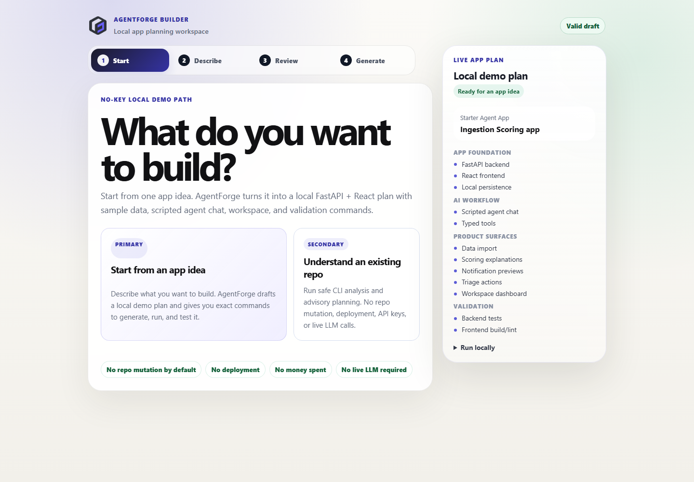 | Start with one app idea in the local Builder. |
| 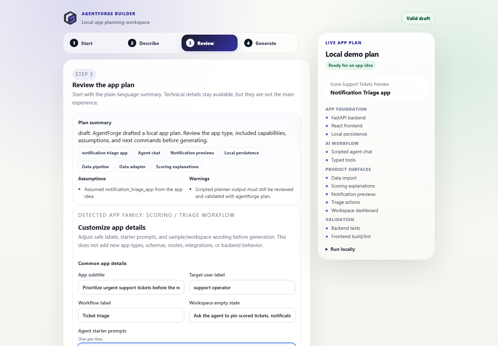 | Review the drafted plan, assumptions, warnings, and persistent Live app plan before raw YAML. |
| 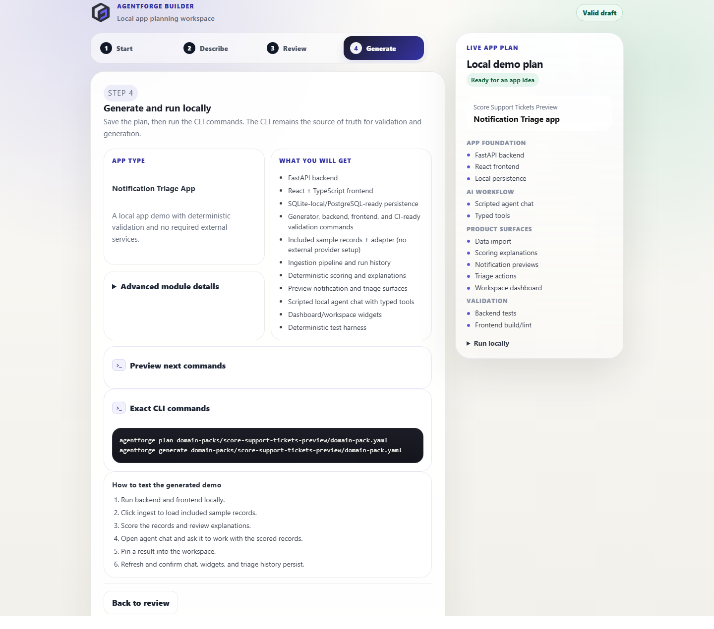 | Copy the exact local CLI commands; the CLI remains the source of truth for validation and generation. |

Scoring and triage generated app:

| Step | What to look for |
| --- | --- |
| 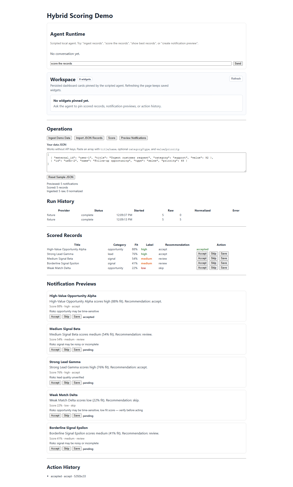 | Ingest/import records, score them, preview notifications, and triage results. |
| 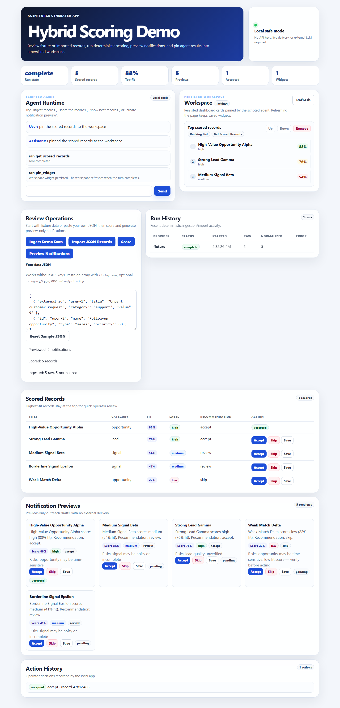 | Use the scripted local agent to work with scored records and pin a workspace widget. |
| 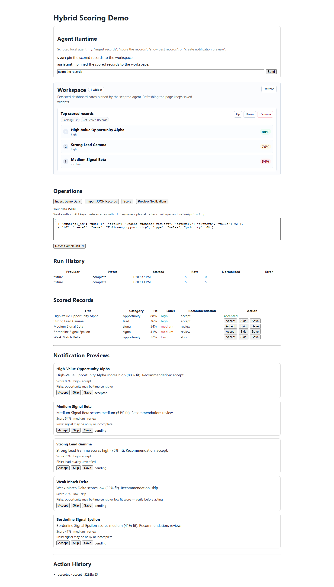 | Refresh to confirm persisted chat/workspace state and action history. |

Project and task workspace generated app:

| Step | What to look for |
| --- | --- |
| 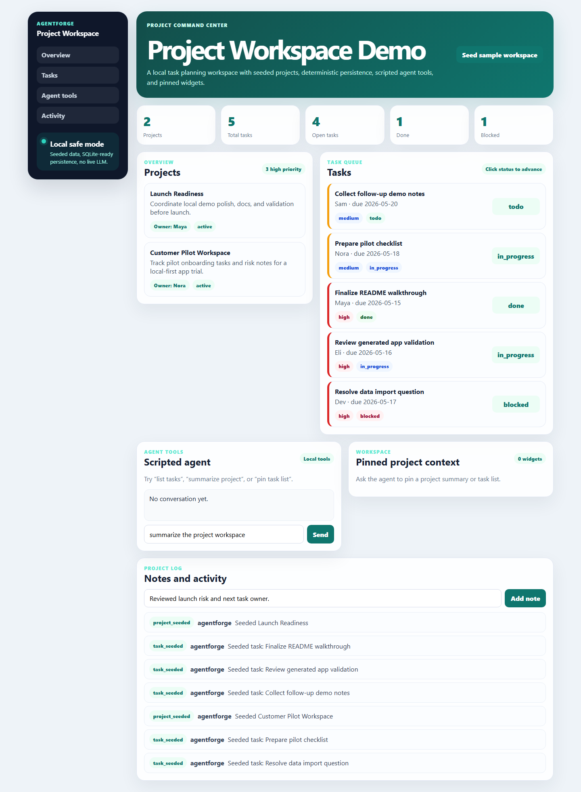 | Seed projects and tasks, then review the dashboard counts and project cards. |
| 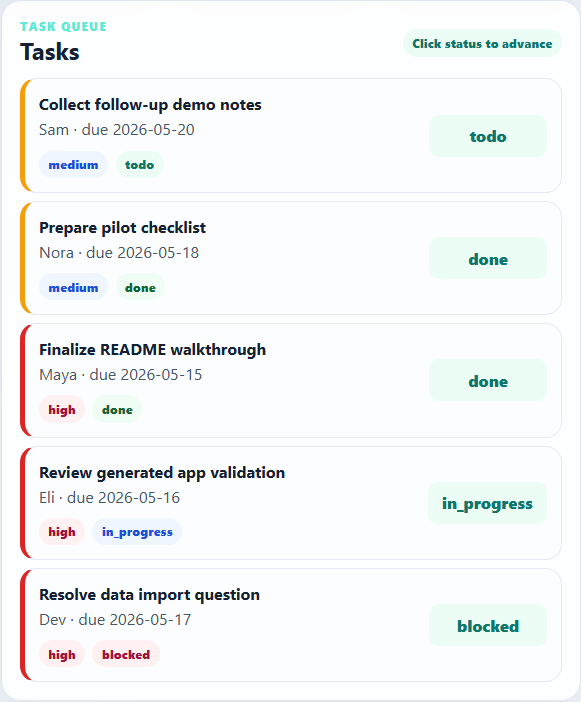 | Advance task statuses and see project/task state update locally. |
| 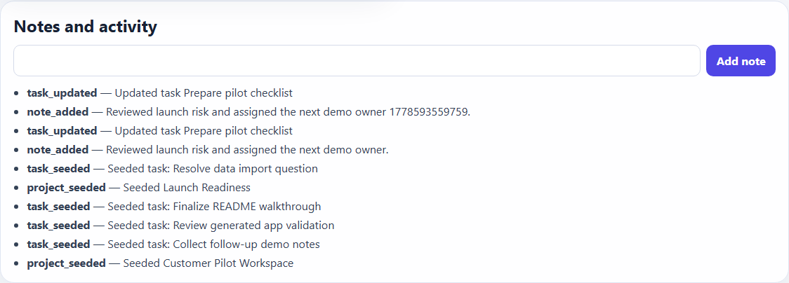 | Add operator notes and review the generated activity feed. |
| 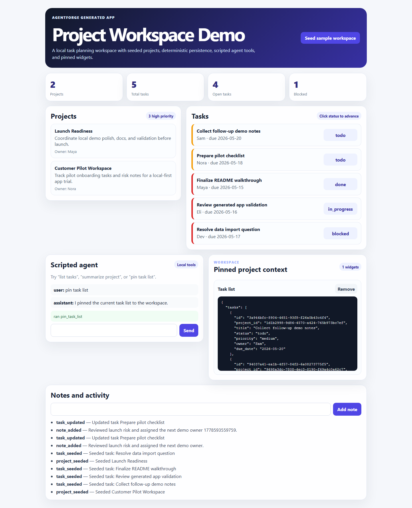 | Ask the scripted agent to pin a task list into the workspace. |
| 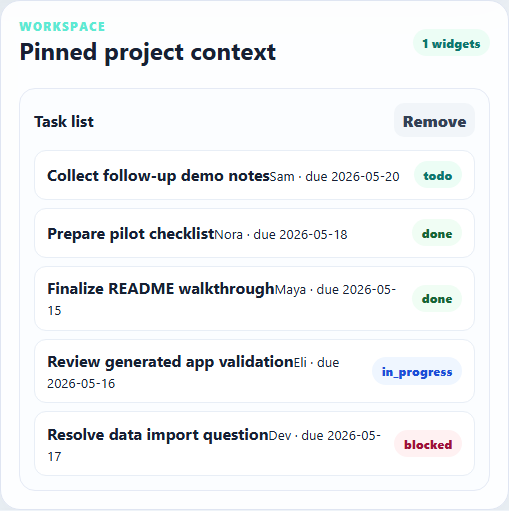 | Refresh to confirm pinned workspace widgets persist. |

## Golden demo path

1. Open the local Builder.
2. Draft an App Blueprint from an app idea.
3. Validate and plan the Blueprint.
4. Generate the app.
5. Run the generated app.
6. Ingest or import records, score them, and triage results.
7. Use the scripted agent chat.
8. Pin an agent result into the workspace.
9. Refresh and show persisted chat, widgets, and triage history.

Use the Project Workspace screenshots as the alternate generated-app proof point after the scoring/triage path: seed projects/tasks, update task status, add a note, pin the task list from the scripted agent, and refresh to show persistence.

Follow the full walkthrough in [docs/DEMO_GUIDE.md](docs/DEMO_GUIDE.md).

## Secondary path: existing repos

If you already have an app, AgentForge can produce safe planning artifacts:

```bash
agentforge analyze-repo path/to/repo --format md --output repo-analysis.md
agentforge plan-extension path/to/repo --format md --output extension-plan.md
agentforge prepare-extension path/to/repo --dry-run
agentforge plan-deployment path/to/repo --format md --output deployment-plan.md
```

This path is analysis/planning-first. By default it does not mutate the target repository, deploy, install packages, run cloud CLIs, or call live LLMs/APIs.

## Command Map

| Intent | Command | What it does | Writes files? | Can modify an existing repo? | Safety notes |
| --- | --- | --- | --- | --- | --- |
| Create new apps | `agentforge serve-builder` | Runs the local Builder/planner server | No target app writes | No | Local deterministic planner; no live LLM/API |
| Create new apps | `agentforge draft-blueprint` | Drafts a Blueprint from an idea | Only with `--out` | No | Validates against generator schema |
| Create new apps | `agentforge init-blueprint` | Creates a starter Blueprint | Yes, new Blueprint path | No | Blueprint-only starter |
| Create new apps | `agentforge plan` | Validates a Blueprint and previews generation | No | No | Source of truth before generation |
| Create new apps | `agentforge generate` | Generates a FastAPI + React app from a Blueprint | Yes, generated app output | No existing repo mutation by default | Use `--force` only when intentionally replacing generated output |
| Understand existing repos | `agentforge analyze-repo` | Produces a local compatibility report | Only with `--output` | No | Analysis-only; skips local/vendor/generated dirs |
| Understand existing repos | `agentforge plan-extension` | Plans possible AgentForge module additions | Only with `--output` | No | Advisory; no patches applied |
| Understand existing repos | `agentforge prepare-extension` | Creates or previews a safe patch/planning bundle | Bundle mode writes output dir; dry-run writes nothing | Only in explicit apply mode | Apply is limited to low-risk docs/blueprint/checklist files |
| Understand existing repos | `agentforge plan-deployment` | Produces deployment readiness guidance | Only with `--output` / docs bundle | No by default | Does not deploy/provision/store secrets |
| Safety / planning | `prepare-extension --dry-run` | Shows planned writes and safety checks | No | No | Recommended before any apply |
| Safety / planning | `prepare-extension --apply --yes` | Applies approved low-risk files | Yes | Yes, limited | Refuses risky runtime/package/router/CI edits |
| Safety / planning | `plan-deployment` | Builds a deployment plan/checklist | Optional report/docs output | No | Planning-only |

See [docs/COMMAND_REFERENCE.md](docs/COMMAND_REFERENCE.md) for examples and detailed write behavior.

## What AgentForge generates today

AgentForge currently includes multiple deterministic generated app examples:

- `hybrid-scoring-demo` — fixture ingestion, deterministic scoring, notification preview, triage actions, scripted agent chat, and workspace widgets.
- `project-workspace-demo` — seeded projects/tasks, status and priority updates, notes/activity, scripted agent tools, and workspace widgets.

Both examples are local-first FastAPI + React apps with backend tests and frontend build/lint validation. Neither requires live LLM/API access for the default path.

Both generated app families now support a small controlled customization layer for app copy, entity labels, workflow wording, agent starter prompts, workspace labels, and sample-data wording. This makes generated apps feel user-shaped within the supported archetypes without claiming arbitrary app generation.

Generated scoring snapshot:

```text
examples/hybrid-scoring-demo/
```

Generate either app from its Blueprint:

```bash
agentforge generate domain-packs/hybrid-scoring-demo/domain-pack.yaml --force
agentforge generate domain-packs/project-workspace-demo/domain-pack.yaml --output .tmp/project-workspace-demo --force
```

## Quickstart without the Builder

```bash
pip install -e generator/
agentforge plan domain-packs/hybrid-scoring-demo/domain-pack.yaml
agentforge generate domain-packs/hybrid-scoring-demo/domain-pack.yaml --force
agentforge plan domain-packs/project-workspace-demo/domain-pack.yaml
agentforge generate domain-packs/project-workspace-demo/domain-pack.yaml --output .tmp/project-workspace-demo --force
make validate
```

Run the generated stack:

```bash
make run-backend
make run-frontend
```

Open the frontend at `http://localhost:5173` and the API docs at `http://localhost:8000/docs`.

## Validation and release readiness

Local validation targets:

```bash
python -m pytest tests/generator/ -v
make validate
```

`make validate` runs generator tests, generated backend tests, frontend build, and frontend lint. Playwright E2E is available with a live stack:

```bash
make run-e2e
```

CI status:

- No `.github/workflows/` workflow is currently present in this repository.
- A CI badge should only be added after reliable CI exists and passes.
- A green badge is valuable for a portfolio-ready project, but it should not be faked.

## Docs

README is the guided landing page. Detailed docs live here:

- [Docs Index](docs/README.md)
- [Getting Started](docs/GETTING_STARTED.md)
- [Demo Guide](docs/DEMO_GUIDE.md)
- [Command Reference](docs/COMMAND_REFERENCE.md)
- [Safety Model](docs/SAFETY_MODEL.md)
- [App Blueprint Specification](docs/DOMAIN_PACK_SPEC.md)
- [AgentForge v0 Architecture](docs/AGENTFORGE_V0_ARCHITECTURE.md)
- [Archetype Model](docs/ARCHETYPE_MODEL.md)
- [Roadmap](docs/AGENTFORGE_ROADMAP.md)
- [Repo Analyzer](docs/REPO_ANALYZER.md)
- [Repo Extension Planner](docs/REPO_EXTENSION_PLANNER.md)
- [Safe Patch Application](docs/SAFE_PATCH_APPLICATION.md)
- [Deployment Planner](docs/DEPLOYMENT_PLANNER.md)
- [Blueprint Builder README](builder/README.md)

## What is not built yet

AgentForge is deliberately constrained. It does not yet provide:

- live LLM/API usage as the default path;
- broad arbitrary app generation;
- invasive repository conversion;
- autonomous code modification;
- real notification delivery;
- production deployment automation;
- cloud resource provisioning;
- mature multi-template support.

## Repository layout

```text
AgentForge/
  builder/                       Local Blueprint Builder UI
  docs/                          Guides, safety model, architecture, planner docs
  domain-packs/                  App Blueprints
  generator/                     Python package for the agentforge CLI
  templates/                     Application Templates
  examples/hybrid-scoring-demo/  Committed generated demo app
  tests/generator/               Generator and builder tests
```
